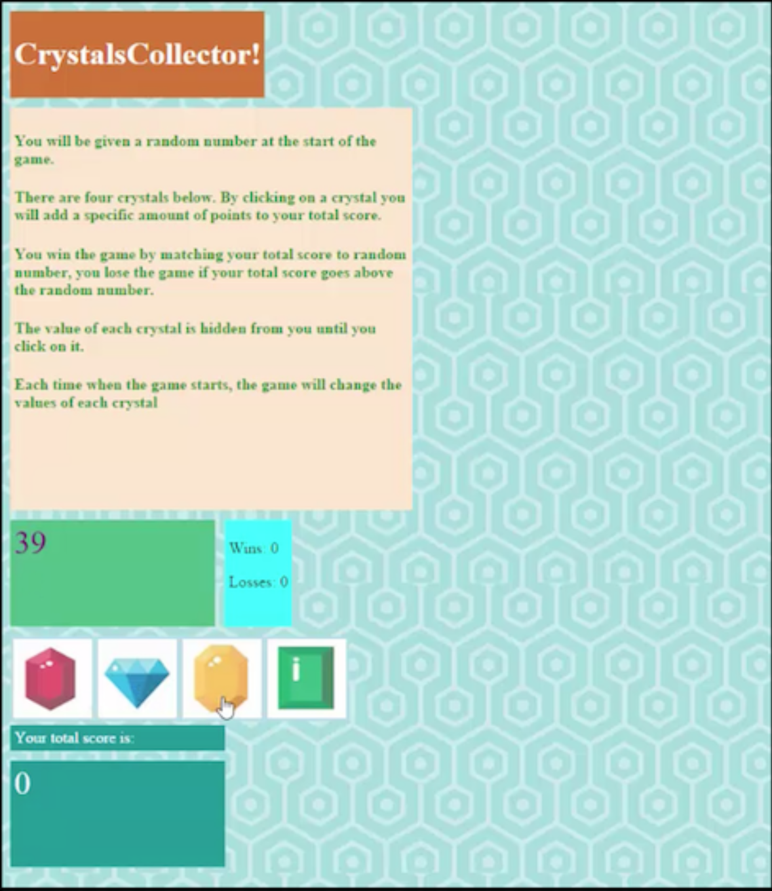
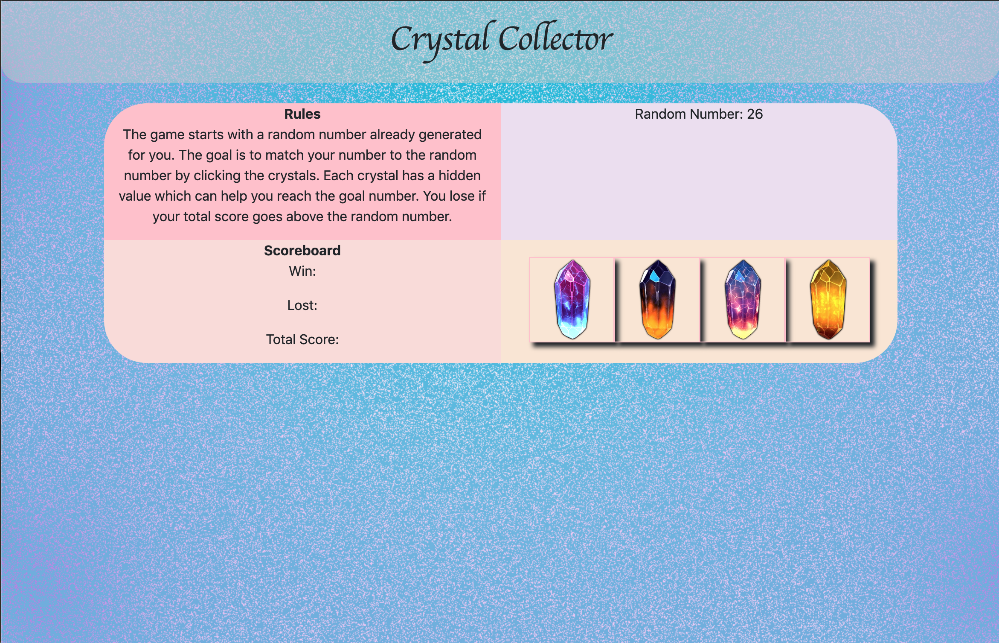

# Crystal Game

## About
Crystal Game is a game on the browser window. The user clicks on the crystal images to be able to match the given random number.

## How to play
1. To begin you must click on the crystals 
2. Each crystal is given its own random number in each refresh
3. To win you must match the given random number by clicking on the crystals and carefully figuring out the value of each crystal.
4. If you go above the random number, you lose.

## Technologies Used:
* JavaScript
* jQuery
* Bootstrap

## Before and After

